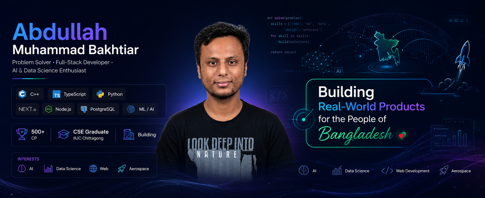

 

 

  <h1 style="display: inline-block;">Hi 👋, I'm Abdullah Muhammad Bakhtiar</h1>
  

 

### 👨‍💻 About Me & Professional Summary

👋 Hi, I’m **ABDULLAH MUHAMMAD BAKHTIAR** ([@ambakhtiar](https://github.com/ambakhtiar))
🖥️ I’m currently focused on modern web development with **Next.js, React, TypeScript, and Tailwind CSS.**
🗄️ Using **Node.js, Express.js, PostgreSQL (Prisma ORM), and MongoDB** for the backend.
🛠️ I’m currently learning **Docker, AWS, Data Science, Machine Learning, and Generative AI.**
💬 Ask me about **Full-Stack (Next, Node, PostgreSQL, MongoDB)** or **Competitive Programming (500+ problems)**.
🌐 Explore my **Portfolio**, my [**GitHub**](https://github.com/ambakhtiar), and my **Resume**
📝 Connect with me on [**LinkedIn**](https://linkedin.com/in/ambakhtiar)
📫 Feel free to reach out via [**Email**](mailto:ambakhtiar88@gmail.com) or [**WhatsApp**](https://wa.me/8801614418883)/[**Telegram**](https://t.me/+8801614418883)

 

### 📫 Let's Connect!

  
  &nbsp;&nbsp;
  
  &nbsp;&nbsp;
  
  &nbsp;&nbsp;
  
  &nbsp;&nbsp;
  
  &nbsp;&nbsp;
  

 

### 🛠️ Tech Stack & Tools

  <strong>Languages:</strong> 
  

  <strong>Frontend Development:</strong> 
  

  <strong>Backend Development:</strong> 
  

  <strong>Databases & ORM:</strong> 
  

  <strong>Authentication & Payment:</strong> 
  &nbsp;&nbsp;
  &nbsp;&nbsp;
  

  <strong>Tools & Technologies:</strong> 
  

 

### 📊 GitHub Statistics (All for ambakhtiar)

  

  

  

 

   

 

  
  &nbsp;&nbsp;
  

 

  

 
